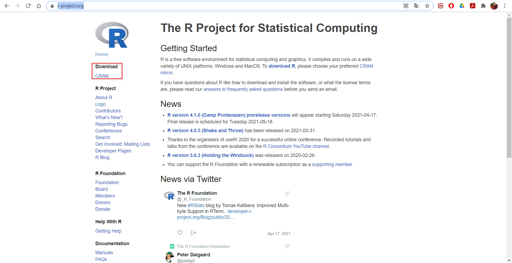

```{r setup, include=FALSE}
knitr::opts_chunk$set(echo = TRUE)
library(tidyverse)
library(gt)
```

# Introducción

R es un Lenguaje de programación orientado a objetos para la manipulación y análisis estadístico de datos con gran aceptación en la comunidad científica. Su filosofía de software libre y de código abierto consolidan su gran popularidad y aceptación, además de la cada vez más creciente comunidad que que permanentemente trabaja para ampliar las potencialidades de este entorno computacional a través del dessarollo de librerías (paquetes). Lo anterior, ha posibilitado el tratamiento de datos geográficos en R, que si bien son datos susceptibles de análisis, la existencia de un componente espacial (ubicación en el espacio) hacen complejo su tratamiento. Sin embargo, gracias a la disponibilidad de librerías de R destinadas al tratamiento específico de este tipo de datos, han logrado integrarse con éxito en los flujos de trabajo.

R se distribuye de manera gratuita para diferentes plataformas y diferentes arquitecturas de sistemas operativos, las cuales pueden ser accedidas desde la página web de este proyecto (<https://www.r-project.org/>). Una panorámica general de este portal se muestra en la Figura 1).

```{r r-project, out.width = '80%', fig.align = 'center', echo = FALSE}

```
<p align = "center">Figura 1.Página oficial de R project.</p>

Una vez descargado e instalado R en nuestro ordenador es posible iniciar cualquier flujo de trabajo para el tratamiento de datos. No obstante, la interfaz nativa de R es demasiado "plana", haciendola poco amigable para personas con poca experiencia en progamación o totalmente neófitos. Por esta razón, se han popularizado diversos entornos de desarrollo o IDE's (por sus siglas en inglés), entre los que destaca R-Studio, el cual mediante el uso de colores para la distinción de funciones, argumentos y comentarios facilita la lectura de código, sumado a las invaluables ayudas de autocompletado de nombre de funciones (haciendo inecesario la memorización de las mismas), cierre automatico de símbolos de agrupación y comillas e indexación minimizan la comisión de errores de sintaxis. R-Studio puede descargarse, gratuitamente, desde su página oficial (<https://www.rstudio.com/>). De forma general, esta página se ve como se ilustra en la Figura 2.

```{r R-Studio, out.width = '80%', fig.align = 'center', echo = FALSE}

```
<p align = "center">Figura 2.Página oficial de R-Studio.</p>

## Tipos de datos en R

La instalación de R base, reconoce diferentes tipologías de datos en función de su naturaleza. Un resumen de estos se muestra en la siguiente Tabla 1.

Tabla. Tipo de datos en R.
```{r tipodatos, echo = FALSE}

DF <- tibble(
  Type = c("Integer","Numeric","Character","Factor","Logical","NA","Null"),
  Example = c("1", "1.3", "Uno", "Uno", "TRUE", "NA", "NULL")
)

gt(data = DF) %>% 
  tab_options(table.width = pct(x = 100), table.align = "center", column_labels.font.weight = "bold") %>% 
  cols_align(align = "center") 
```

Sin embargo, existen muchas otras tipologías de datos introducidas por otras estructuras de datos hacia las cuales se han expandido las funcionalidades de R a través de paquetes. A lo largo de este curso revisaremos algunas tipologías de datos asociados a un componente geográfico.

## Estructuras de datos en R

De forma generica, las estructuras de datos en R son objetos que almacenan datos en cualquiera de sus tipologías. En este sentido, cuando ejecutamos un flujo de trabajo en R, lo que inherentemente estamos haciendo es manipular algunas de las estructuras que este entorno soporta.

Las estructuras de datos tienen diferentes características. Entre ellas, las que distinguen a una estructura de otra son su número de **dimensiones** y si son **homogeneas** o **hereterogeneas** (Tabla 2).

Table 2. Estructuras de datos en R.
```{r EstructurasDatos, echo = FALSE}

df <- tibble(
  Dimensiones = c("1", "2", "n"),
  Homogeneas = c("Vector", "Matriz", "Array"),
  Heterogeneas = c("Listas", "Data frame", ""),
  .rows = 3
  )

gt(data = df) %>% 
  tab_options(table.width = pct(100), column_labels.font.weight = "bold") %>% 
  cols_align(align = "center")

```

A continuación, haremos una explicación resumida de cada una de estas estructuras y la forma en que estos son construídos de manera mecánica en R.

### Vectores

Los vectores son la estructura de datos más sencilla para trabajar dentro de R. De forma general, se definen como una colección de datos de una misma tipología y, pueden ser útiles para almacenar los valores que asume una variable unitaria.

Los vectores poseen dos (2) características fundamentales: (1) **Tipo**, que informa la tipología de datos contenida dentro de un vector; (2) **Longitud**, que representa el número de elementos que almecena un vector.

Dentro de R, la creación de vectores se realiza con la función de concatenación `c()` proporcionada por la configuración de instalación base de R. Observemos como se construyen vectores de diferentes tipologías:

```{r vectores, results = 'asis'}

Numeric <- c(1, 2, 3, 4 , 5)

Character <- c("María", "José", "Érika", "Carlos", "Juan")

Sequence <- seq(from = 1, to = 10, by = 2)

Factor <- factor(x = c(1, 2, 3, 4, 5), levels = c("Rosas", "Girasoles", "Orquideas", "Margaritas", "Tulipanes"))

Logical <- c(TRUE, FALSE, FALSE, TRUE, FALSE)

```

### Matrices 

Diferentes fuentes coinciden en describir a las matrices como vectores bidimensionales, es decir, colecciones de datos de un mismo tipo que además de la longitud, poseen un ancho, originando de esta forma un arreglo rectangular de almacenamiento que posee filas y columnas, común en la manipulación de datos en R.

La creación de estas estructuras en R se hace a través de la función `matrix()`, ingresando dentro de ésta, algunos argumentos que permiten dar el formato deseado a la matriz resultante.

```{r matriz, results = 'asis'}

Matriz1 <- matrix(data = c(1, 2, 3, 4, 5, 6, 7, 8, 9), nrow = 3, ncol = 3, byrow = FALSE, 
                  dimnames = list(1:3, c("V1", "V2", "V3")))

Matriz2 <- matrix(data = c(LETTERS[1:5], letters[1:5]), nrow = 5, ncol = 2, byrow = FALSE, 
                  dimnames = list(1:5, c("Mayúsculas", "Minúsculas")))

```

### Data frame

Los data frames son estructuras de datos de dos dimensiones (rectangulares) que pueden contener datos de diferentes tipos, por lo tanto, son heterogéneas. Esta estructura de datos es la más usada para realizar análisis de datos y seguramente les resultará familiar si han trabajado con otros paquetes para la manipulación de datos.

Podemos entender a los data frames como una versión más flexible de una matriz. Mientras que en una matriz todas las celdas deben contener datos del mismo tipo, los renglones de un data frame admiten datos de distintos tipos, pero sus columnas conservan la restricción de contener datos de un sólo tipo.

En términos generales, los renglones en un data frame representan casos, individuos u observaciones, mientras que las columnas representan atributos, rasgos o variables.

La creación de data frame en R se realiza mediante la función `data.frame()`, como se muestra a continuación.

```{r dataframe, echo = FALSE, results = 'asis'}

DataFrame <- data.frame(Nombre = c("María", "José", "Érika", "Carlos", "Juan"),
                        Edad = c(30, 25, 21, 28, 31),
                        Altura = c(1.55, 1.75, 1.68, 1.70, 1.75),
                        Peso = c(60, 80, 73, 72.5, 78.5))

```

### Listas

Las listas, al igual que los vectores, son estructuras de datos unidimensionales, sólo tienen largo, pero a diferencia de los vectores cada uno de sus elementos puede ser de diferente tipo o incluso de diferente clase, por lo que son estructuras heterogéneas.

Podemos tener listas que contengan datos atómicos, vectores, matrices, arrays, data frames u otras listas. Esta última característica es la razón por la que una lista puede ser considerada un vector recursivo, pues es un objeto que puede contener objetos de su misma clase.

Para su contrucción, R proporciona la función `list()`.

```{r listas, echo = TRUE, results = 'asis'}

MiLista <- list(Vector = c("A", "E", "I", "O", "U"),
                Matriz = Matriz2,
                DataFrame = DataFrame)

```

