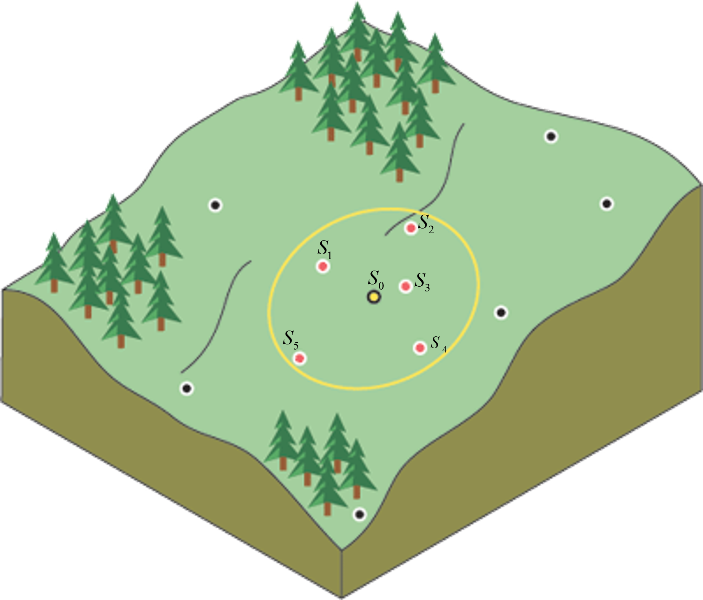

```{r setup, include=FALSE}

knitr::opts_chunk$set(echo = TRUE)
library(gt)
library(tidyverse)

```

Diversos procesos de captura de datos espaciales son inherentemente puntuales, es decir, las mediciones de los atributos (variables) que caracterizan un fenómeno de estudio se realizan en locaciones con coordenadas conocidas y, a partir de estas, se busca realizar predicciones sobre otras locaciones o sobre el continuo del área de estudio. Ejemplo de esto lo constituyen la obtención de muestras de suelo para fines de caracterización fisicoquímica, los punto de monitoreo de calidad de aire, la locación de estaciones de medición de variables meteorológicas (temperatura, precipitación, humedad, etc.), puntos de medicion de concentración de contaminantes (en agua, suelo, aire) y muchos ejemplos más.

En los ejemplos expuestos, es fator común la dependencia espacial de las variables mencionadas, o dicho de otra manera, la autocorrelación espacial que presentan las mediciones de las variables entre puntos geográficamente cercanos, principio conocido como la **ley de la geografía** o simplemente **principio de Tobbler**: 

>_Todas las cosas están relacionadas entre sí, pero las cosas más próximas en el espacio tienen una relación mayor que las distantes_. Waldo Tobbler (1970).

Teniendo en cuenta la autocorrelación de lo objetos en el espacio, se han desarrollado diversas técnicas (procedimientos) para realizar estimaciones/predicciones de los valores de una variable en locaciones desconocidas (no muestreadas), tomando como punto de partida la información colectada en locaciones cercanas. Estos procedimientos, de forma genérica, se clasifican en **deterministicos**, basados en la aplicación de constructos matemáticos (ecuaciones) para realizar las predicciones sin ser necesario que los datos tengan una estructura de distribución dada o se ajusten al cumplimiento de unso requsitos o sigan un modelo funcional, como ocurren en la familia de métodos de interpolación de la estadística espacial o **geoestadistica**. En este post nos concentraremos en la primera categoría, enfatizando las discusiones en la aplicación del método del Inverso de la Distancia Ponderada (IDW, por sus siglas en inglés). 

# Inverso de la Distancia Ponderada (IDW)

La interpolación mediante IDW determina los valores de celda (pixel) de la superficie a interpolar a través de una combinación lineal ponderada de un conjunto de puntos de muestra para una variable dependiente de su ubicación geográfica. En este método de interpolación, la ponderación de los valores es una función de la distancia entre los puntos a estimar y los puntos con valores conocidos, de manera que, conforme aumenta la distancia entre estos, el peso (importancia) de los puntos decrece. Siguiendo lo anterior, los valores estimados o predichos para un punto particular son determinados como la media ponderada de los valores medidos en los otros puntos (Figura 1), de acuerdo a la siguiente ecuación:

$$\hat{Z}({s_{0}}) = \frac{\sum_{i=1}^{n}w(s_{i})Z(s_{i})}{\sum_{i=1}^{n}w(s_{i})}$$

donde

- $\hat{Z}({s_{0}})$ es el valor predicho en la ubicación $s_{0}$.
- $w(s_{i})$ es el peso en la medición del punto $i$.
- $Z(s_{i})$ es el valor de la medición en el punto $i$.

<p align = "center">

</p>
<p align = "center">Figura 1. Distancia entre punto con valores a estimar y puntos con valores conocidos <br> (Adaptado de: http://desktop.arcgis.com/en/arcmap/10.3/tools/spatial-analyst-toolbox/how-kriging-works.htm).</p>

Un aspecto interesante de discutir es que las ponderaciones $w(s_{i})$ son determinadas como el inverso de la distancia entre los puntos a una potencia $p$:

$$w(s_{i}) = \frac{1}{d(s_{0}, s_{1})^{p}}$$
donde 

- $w(s_{i})$ es el peso en el punto de medición $i$.
- $d(s_{0}, s_{1})$ es la distancia entre el punto a predecir y el punto con mediciones.

La potencia $p$, controla la significancia de puntos conocidos en los valores interpolados basándose en la distancia desde el punto de salida (objetivo a predecir); asume valores reales positivos y su valor predeterminado es 2. No obtante, es un parámetro ajustable al definirle un valor de potencia más alto, se otorga mayor importancia (peso) a los puntos más cercanos. Así, los datos cercanos tendrán más influencia y la superficie tendrá más detalles (será menos suave). A medida que aumenta la potencia, los valores interpolados comienzan a acercarse al valor del punto de muestra más cercano. 

Debido a que la fórmula de IDW no está relacionada con ningún proceso físico real, no hay forma de determinar que un valor de potencia en particular es demasiado grande. Como guía general, una potencia de 30 se considera extremadamente grande y su uso sería cuestionable.

La implementación de IDW en R se realiza de forma relativamente sencilla, usando la función `idw()` del paquete **gstat**, previa preparación de los datos que participan como _input_ de esta función. La mejor forma de explicar la forma de funcionamiento de esta es a través de un ejemplo, en este caso,la interpolación de datos de totales mensuales de precipitación (mm) para el departamento de La Guajira, Colombia, durante el 2015.

Inicialmente, leeremos la base de datos y límites administrativos de La Guajira, mediante el siguiente bloque de código:

```{r, echo = TRUE, results = 'asis', message = FALSE, warning = TRUE}

library(sf) # Manipulación de datos vectoriales
library(stars) # Manipulación de datos ráster siguiendo la filosofía de tidyverse
library(gstat) # Funciones de interpolación espacial
library(tidyverse) # Manipulación de datos ordenados (tidy)
library(nngeo) # Funciones de spatial join
library(readxl) # Lectura de archivios xlsx
library(RColorBrewer) # Uso de paletas de colores para visualización

guajira <- read_sf("C:/Users/Luis/Documents/Manipulacion analisis datos espaciales R/Datos/shp/Municipios_Guajira.shp") %>% 
  summarise() %>% 
  st_remove_holes() %>% 
  mutate(Name = "La Guajira")

ppt <- read_excel(path = "C:/Users/Luis/Documents/Manipulacion analisis datos espaciales R/Datos/Totales mensuales precipitacion Guajira 2015.xlsx") %>% 
  st_as_sf(coords = c("x", "y"), crs = "OGC:CRS84") %>% 
  st_transform(crs = "EPSG:3116")

```

Nótese la necesidad de disolver los limites administrativos de los municipios de La Guajira para obtener lo límites de este departamento, la aplicación de la función `st_remove_holes()` para remover los vacíos que pudiesen presentarse del paso anterior y la creación de una columna (_Name_) en la tabla de atributos con el nombre del departamento. Así mismo, los datos en cuestión fueron leidos como tabla (Tabla 1), posteriormente convertidas aun objeto espacial (_sf_) y transformado sus coordenadas al sistema proyectado MAGNA-SIRGAS / Colombia Bogota zone (EPSG: 3116).

Tabla 1. Valores de totales mensuales de precipitación (mm) en diferentes estaciones meteorológicas de La Guajira durante el 2015.
```{r, echo = FALSE}

gt(data = st_drop_geometry(x = ppt)) %>% 
  tab_options(container.height = px(x = 500), container.overflow.y = TRUE, table.width = pct(x = 100), table.align = "center", column_labels.font.weight = "bold") %>% 
  cols_align(align = "center")

```

<br>
Una representación gráfica de las estaciones meterológicas de este análisis se muestran en la Figura 2.

```{r, echo = FALSE, message = FALSE, warning = FALSE, fig.align = 'center'}

ggplot() +
  geom_sf(data = guajira, fill = "white") +
  geom_sf(data = ppt, color = "red") +
  xlab(label = "Oeste") +
  ylab(label = "Norte") +
  theme_bw()

```
<p align = "center">Figura 2. Estaciones meterológicas en el departamento de La Guajira.</p>

A continuación, creamos una grilla (requerida) donde se realizará la predicción de totales mensuales de precipitación en las locaciones diferentes a las estaciones meteorológicas (Figura 3).

```{r, echo = TRUE}

grid <- st_as_stars(.x = st_bbox(guajira), dx = 500, dy = 500) %>% 
  st_crop(y = guajira)

```

```{r, echo = FALSE, fig.align = 'center', message = TRUE, warning = FALSE}

ggplot() +
  geom_stars(data = grid, show.legend = F) +
  geom_sf(data = guajira, fill = NA) +
  scale_fill_gradient(low = "red", high = "red", na.value = NA) +
  xlab(label = "Oeste") +
  ylab(label = "Norte") +
  theme_bw()

```
<p align = "center">Figura 3. Grilla de interpolación para el departamento de La Guajira.</p>

Luego, creamos la interpolación sobre la grilla mostrada en la Figura 3, siguiendo la siguiente línea de código.

```{r}

idw <- idw(formula = Abr ~ 1, locations = ppt, newdata = grid)

```

Aquí, la función requiere como argumentos una formula (`Abr ~ 1`), que especifica las relaciones entre una variable dependiente o respuesta (a la izquierda de ~) y una o varias variables independientes o explicativas (a la derecha ~). En este caso, a la derecha de ~ se indica un 1, especificando que no existen variables independientes. Así mismo, se requiere las ubicaciones (_location_) usadas para ajustar el IDW. Luego la grilla (_newdata_) sobre el cual se realizarán las estimaciones de la variables objetivo: totales mensuales de precipitación (mm) durante el mes de abril del 2015.

De lo anterior se obtiene los siguientes resultados gráficos (Figura 4).

```{r, message = FALSE, warning = FALSE}

ggplot() +
  geom_stars(data = idw) +
  geom_sf(data = guajira, fill = NA) +
  scale_fill_gradientn(name = "Precipitación (mm)", colours = brewer.pal(n = 4, name = "Reds"), na.value = NA) +
  xlab(label = "Oeste") +
  ylab(label = "Norte") +
  theme_bw()

```
<p align = "center">Figura 4. Valores interpolados de totales mensuales de precipitación para el mes de abril de 2015.</p>

Una de las ventajas que ofrece R en el análisis de datos espaciales en relación a los entornos SIG de escritorio, es la posibilidad de automatizar procesos; en el ejemplo anterior, solo se interpolaron los datos de precipitación para el mes de abril. Podriamos ampliar el análisis para mapear los totales mensuales de precipitación para todos los meses del 2015, mediante la aplicación de un bucle **for** como se muestra en las siguientes líneas de código.

```{r, echo = TRUE, message = FALSE, warning = FALSE, results = 'hide'}

mes <- colnames(st_drop_geometry(ppt))[3:(ncol(ppt)-1)]
result <- list()
for(i in mes){
  f <- as.formula(paste0(i, " ~ 1"))
  idw <- idw(formula = f, locations = ppt, newdata = grid)
  idw.pred <- idw["var1.pred",,]
  result[[i]] <- idw.pred
}

```

Aquí, inicialmente se remueve la geometría del objeto **ppt** y se seleccionan los nombres de columnas que corresponden a los meses del año, luego se crea un objeto tipo lista vacío que se rellenará con los resultados del ciclo **for**. Posteriormente, se aplica el ciclo **for** para cada mes indicado. 

A continuación, combinamos los elementos de la lista en un ráster multibanda con la función `do.call` y `c` . El parámetro adicional `Along = 3` asegura que las capas se "apilan" para formar una tercera dimensión, como indica el siguiente __chunk__.

```{r, echo = TRUE, message = FALSE, warning = FALSE}

result$along <- 3
IDW <- do.call(what = c, args = result)

```

Los resultados de lo anterior se muestran en la Figura 5, correspondiente al siguiente bloque de código.

```{r, echo = TRUE, message = FALSE, warning = FALSE, fig.align = 'center', fig.width = 17, fig.height = 12}

ggplot() +
  geom_stars(data = IDW) +
  facet_wrap(~new_dim) +
  geom_sf(data = guajira, fill = NA) +
  scale_fill_gradientn(name = "Precipitación (mm)", colours = brewer.pal(n = 4, name = "GnBu"), na.value = NA) +
  labs(title = "TOTALES MENSUALES DE PRECIPITACIÓN (mm) EN LA GUAJIRA", x = "Longitud",
       y = "Latitud") +
  theme_bw() +
  theme(strip.background = element_rect(fill = NA, colour = NA), 
        strip.text = element_text(face = "bold"), 
        legend.key.height = unit(x = 4, units = "line"))

```
<p align = "center">Figura 5. Interpolación con IDW para valores de totales mensuales de precipitación para el ciclo de un año (2015).</p>
